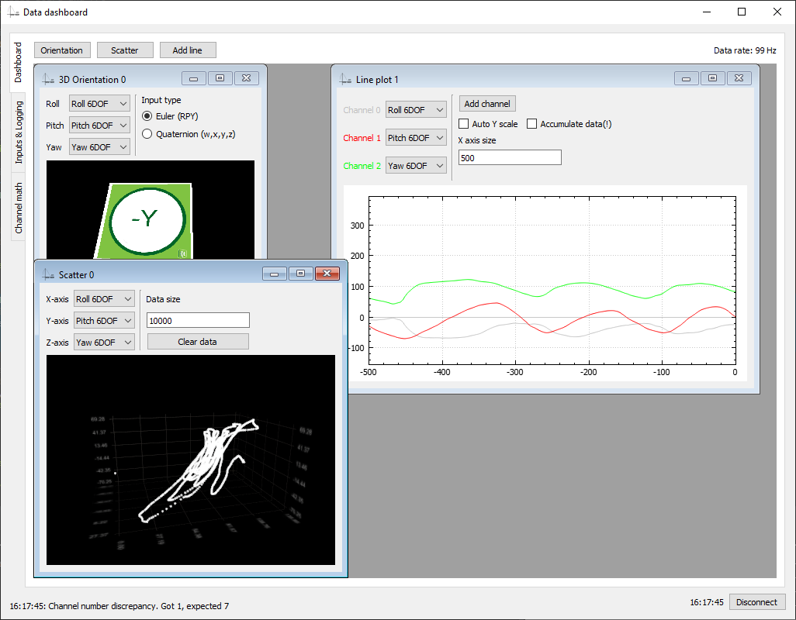
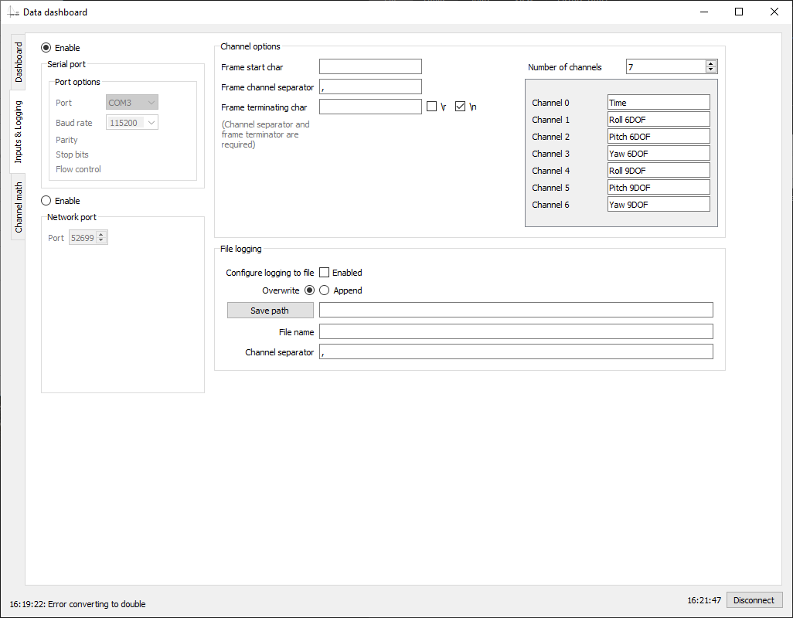
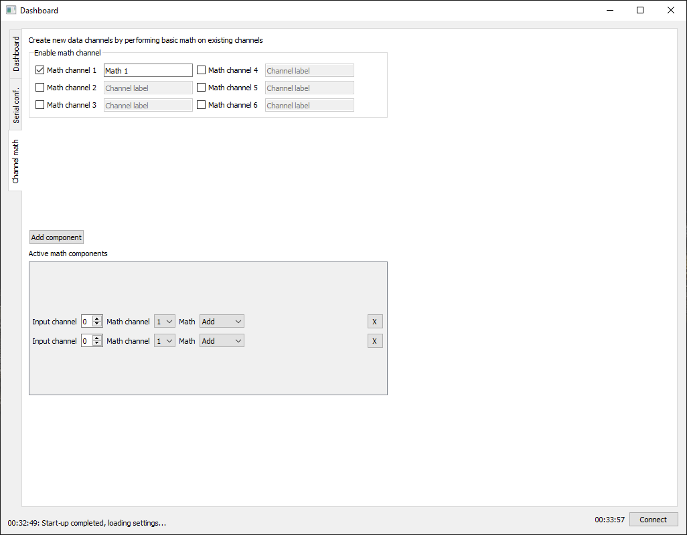

[Data dashboard](https://github.com/vedranMv/dataDashboard)  
=======
 (QT based app for real-time data visualization)

Data dashboard is a program based on QT framework that can be used to to visualize some of the common data types that one comes in contact when working with sensors. Although it was developed during my work with IMU, and is mostly centered around it, it should be versatile enough for other sensors and purposes as well.

It is currently possible to:
* Read data from serial port or network socket (real input channel)
* Show estimated incoming data rate
* Define data frame (specify start/end of frame character, as well as data separator char)
* Perform basic math (addition, subtraction, abs value) on multiple input channels and visualize result of the operations (virtual input channels)
* Log input channels into a file
* Visualize 3D orientation by taking either euler angles or quaternion as input
* Visualize linear data series (flexible number of input channels)
* Plot data in 3D scatter plot (or 2D by specifying one of the inputs as 0)
* Create dashboard consisting of any combination of the visualizations above on runtime
* Preserve settings between runs in a configuration file
* Internal app log for easier troubleshooting

## Demo of current progress
Few screenshots from ``/doc``, demonstrating the UI

[</a>](doc/comparison.PNG)

Demo videos: 
* https://vedran.ml/public/projects/datadashboard/demo.mp4
* https://vedran.ml/public/projects/datadashboard/demo_net.mp4

## How to run

There are several ways to run on both windows and linux.

### Windows

* Download a portable (statically linked) precompiled version from [Releases](https://github.com/vedranMv/dataDashboard/releases)_; or_
* Download QT Creator and compile the source from this repo

### Linux
There are several dependencies for running on linux systems, regardless of which method below you go with:
> ``sudo apt-get install libgl1-mesa-dev libfontconfig1 libxcb-randr0-dev libxcb-xtest0-dev libxcb-xinerama0-dev libxcb-shape0-dev libxcb-xkb-dev``

After that, it's possible to:
* (Ubuntu) Download a precompiled (dynamically linked), version from [Releases](https://github.com/vedranMv/dataDashboard/releases) and launch ``datadashboard.sh``_; or_
* Install QT creator and compile from scratch _; or_
* Compile the project yourself, following the guide below

### Compilation on linux

1. Download libraries and compilation tools (not available on older Ubuntu 18.04/16.04)
> ``sudo apt-get install qt5-default qt5-qmake libqt5datavisualization5-dev libqt5serialport5-dev libqt5core5a libqt5x11extras5-dev``

2. Clone this project (master branch for latest release version)
> ``git clone --depth=1 https://github.com/vedranMv/dataDashboard``

3. Make build directory inside the cloned repo
> ``mkdir dataDashboard/build``   
 ``cd dataDashboard/build``

4. Invoke qmake, then compile with make
> ``qmake -config release ../datadashboard.pro`` 
``make``

5. Run the program
> ``./datadashboard``

## Known issues
* Ubuntu 16.04/18.04: Launching scatter plot crashes the program (in Ubuntu 20.04 works as expected)
* 3D orientation plot sometimes freezes (workaround: just switch to another tab, then reopen _Dashboard_ tab)
* High data rates unsupported (scatter plot results in biggest negative impact on performance, see video)

## Acknowledgments
Made using:
* QT framework & examples
* [CQtDeployer](https://github.com/QuasarApp/CQtDeployer) part of CI pipeline for ubuntu
* [QTCustomPlot](https://www.qcustomplot.com/index.php/introduction) line plot component